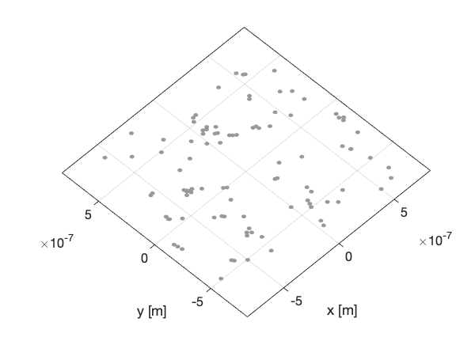
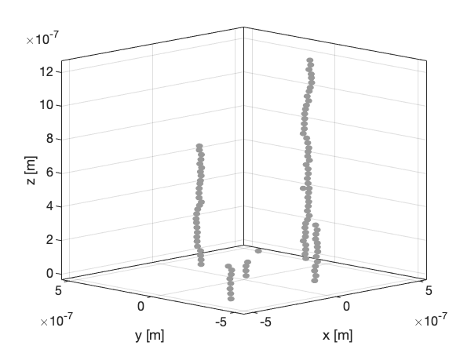

# AeroDep
Molecular dynamics-type simulations of the deposition process of aerosol nanoparticles.

### README table of contents:

1. [Overview](#overview)

2. [Installation and requirements](#installation-and-requirements)

3. [Usage](#usage)

4. [Infiles](#infiles)

5. [Output](#output)

6. [Documentation](#documentation)

7. [Example usage](#example-usage)


### Overview
This program performs molecular dynamics-type calculations in order to simulate the final steps of the deposition process of conductive (and magnetic) aerosol nanoparticles onto an substrate in an electrostatic percipitator (ESP). The particle concentration in the gas is assumed to be very low (<1e6 particles per cm3), such that particles in the gas do not interact, and only one particle is in the aerosol phase in the simulation volume at any given time. When the particle collides with the substrate, or another particle, its properties (such as position and magnetization)
are frozen, and a new particle is spawned.

The calculations are based on numerically solving the Langevin equation describing the system in order to calculate trajectories for individual particles. The forces included are of electrostatic, magnetic, and van der Waals nature. Interactions between the frozen particles and the incoming particle are taken into account using pair-wise interactions. In addition, stochastic motion governed by Brownian motion is included as it has a significant effect on the particles' 
trajectories for small nanoparticles.

The core of the program builds upon the work in Krinke et al. "[Microscopic aspects of the deposition of nanoparticles from the gas phase](https://doi.org/10.1016/S0021-8502(02)00074-5)" Journal of Aerosol Science 33.10 (2002), but with added functionality (such as magnetism).

The integration scheme and Brownian motion treatment is described in Zarutskaya and Shapiro ["Capture of nanoparticles by magnetic filters"](https://doi.org/10.1016/S0021-8502(99)00567-4)  Journal of Aerosol Science 31.8 (2000).


### Installation and requirements 
The program is entirely run and installed using the command line. The only requirements for compiling the program is the `g++` compiler, as well as `make`. See the [GNU website](https://www.gnu.org) for more info on how to install them (for Windows it is recommended to use [minGW](http://mingw.org)).

For compilation `cd` to `AeroDep/src` and type 
```bash
make
```
which will create the compiled executable `AeroDep/bin/AeroDep`.

### Usage
AeroDep is run from `AeroDep/bin` by typing 
```bash
./AeroDep [infile] [particle_file]
``` 
where the commands in `[]` are optional. If no optional arguments are provided the program will execute using its default parameters (see [Infiles](#infiles)). The first optional argument is the file name of the input file containing the simulation parameters (see [Infiles](#infiles)). The second parameter is the file name for a file containing already deposited particles (e.g. an output file from a previous run). If the second option is provided, the particles specified in that file are added to the simulation volume as frozen particles before the simulation is executed.

### Infiles
There are two kinds of input files to AeroDep: parameter input files and particle input files. The parameter input file contains the simulation specific parameters. The syntax in that file has to be `key = value`. Lines starting `#` are ignored, and all  spaces and tabs are always ignored. An example of the contents of a minimal infile is
```
particle_number = 10
```
which sets the total number of particles to 10. All other parameters take their default values. For more examples see the provided example infile `AeroDep/bin/example_infile` and the [examples](#example-usage) below.

All available keys are (default values within parenthesis):

General
- ***particle_number*** total number of particles in the simulation (100)
- ***start_height*** distance in m between a newly generated particle and the highest frozen particle or substrate (500e-9)
- ***box_size*** side-length of the simulation box in m (1.5e-6)
- ***dt*** time step in s (0.5e-9)
- ***interaction_length*** interactions between particles separated by more than this distance, given in m, are ignored (0.5e-6)
- ***print_trajectory*** print trajectories for all particles? (false)
- ***verbose*** print additional information? (false)

ESP
- ***temperature*** chamber/gas temperature in K (300)
- ***mean_free_path*** mean free path of the particles in m (66.5e-9)
- ***remove_surface_charge*** remove particle charge upon collision? (true)
- ***E*** electric field in the chamber in V/m (300e3)

Particle
- ***diameter***  particle diameter in m (30e-9)
- ***charge*** charge of the new particles in elementary charges (-1.0)
- ***density*** the particle's density in kg/m3 (7874.0 Fe)
- ***m_saturation*** saturated magnetization of the particles in A/m2. Used for ferromagnetism (1.707e6 Fe)
- ***particle_susceptibility*** the particles' magnetic susceptibility. Used for paramagnetism (2.2e-5 Al)

Substrate
- ***n_substrate*** refractive index of the substrate (1.4585 Si)
- ***dielectric_substrate*** relative dielectric constant of the substrate (3.9 Si)

Gas
- ***n_gas*** refractive index of the gas (1.0 N2)
- ***dielectric_gas*** relative dielectric constant of the gas (1.0 N2)
- ***v_x*** gas velocity in m/s, x-component (0.0)
- ***v_y*** gas velocity in m/s, y-component (0.0)
- ***v_z*** gas velocity in m/s, z-component (0.0)
- ***dynamic_viscosity*** dynamic viscosity of the gas in kg/m/s (18.13e-6 N2)

Magnetism
- ***Bx*** external magnetic field (B-field) in T, x-component (0.0)
- ***By*** external magnetic field (B-field) in T, y-component (0.0)
- ***Bz*** external magnetic field (B-field) in T, z-component (0.0)
- ***alignment_field_strength*** local H-field strength above which a particle's magnetization is aligned with the field (1e-5)
- ***magnetic*** include magnetic interactions? (true)
- ***magnetic_type*** type of magnetic interaction to use in force calculations. Options are `ferro` and `para`. Default is `ferro`.

Size distribution(s)
- ***diameter_std*** standard deviation in m for the diameter of the particles in a log-norm distribution (0.0)
- ***diameter_std2*** standard deviation in m for the diameter of doubly charged particles in a log-norm distribution (0.0)
- ***double_charge_fraction*** fraction of doubly charged particles (0.0)

Note on paramagnetism: this is an experimental feature based on "[Theoretical comparison of magnetic and hydrodynamic interactions between magnetically tagged particles in microfluidic systems](https://doi.org/10.1016/j.jmmm.2005.01.076)" Journal of Magnetism and Magnetic Materials 293.1 (2005), and as such it is *not* properly tested and cannot account for polydisperse particle sizes.   

The second kind of infile, the particle input file must have the same format as the particle output file described below.

### Output

The main result from running the AeroDep program is a file containing the positions of all the deposited particles in the simulation. This output is always generated and is written to the file `bin/particle_positions`. The file is updated for every 50th generated particle, as well as at the end of the simulation. 

Output file structure: each row corresponds to one particle. There are seven columns with data where column 1-3 is the particle's position, 4-6 its magnetization, and column 7 its diameter. 

The second kind of output files the program can generate are files containing the trajectories of an individual particles. If the `print_trajectory` option is set to `true` one trajectory file is generated for each deposited particle. These files are written to `bin/trajectories` (this folder must exist!). Each row in the file corresponds to the current position (x,y and z coordinate).

Note that periodic boundary conditions are used in the simulations, which sometimes results in trajectories leaving the simulation volume through one side only to immediately enter the volume again through the opposing side. The periodic boundary conditions can also affect the final particle positions where a particle on one boundary can collide with a particle on the opposing boundary.

### Documentation

The documentation for the AeroDep project uses doxygen to generate documentation in html format. Thus, doxygen needs to be installed in order to generate the documentation. For unix-based systems (Linux and macOS) the html output is generated using 
```bash
make docs
```
in `AeroDep/src`. For windows-based systems it is instead recommended to open and run `AeroDep/docs/doxygen_config` using doxywizard.

The generated documentation is accessed by opening `AeroDep/docs/html/index.html` in your browser of choice.

### Example usage

#### Example 1

The most basic use case for AeroDep is to simulate the deposition of negatively charged, nonmagnetic, nanoparticles in an ESP. As an example we will deposit 100 Au particles onto a 1.5x1.5 μm area on a Silicon substrate surrounded by Nitrogen gas. The particle size is set to 30 nm and the particles are assumed to lose their charge upon collision. For such a basic deposition, most of AeroDep's default parameter values will suffice and we only need to provide a few parameters in the infile. More specifically, we need to change the particle density to that of Au, and we need to turn off magnetic interactions.

The infile we use for this reads
```
#Particle 
density = 19320

#Magnetic
magnetic = false
```  
which we name `infile` and put in `AeroDep/bin`. The simulation is then executed using the command
```bash
./AeroDep infile
``` 
in `/AeroDep/bin`. This creates (or overwrites) the file `AeroDep/bin/particle_positions` (see [output](#output)). The resulting particles can then be plotted at their respective positions to study the results and identify any potential self-assembled structures (the visualization is not part of AeroDep). Looking at the deposited particles from a top view yields a plot similar to the one below

<p align="center">
  
</p>


#### Example 2

Another standard use case for AeroDep can be to study the self-assembly of ferromagnetic nanoparticles under the influence of an external magnetic field. 

For this example we will simulate the deposition of 30 nm Fe nanoparticles onto a substrate until we reach a concentration of 100 particles per μm2. For this example the external magnetic field (0.5 T) is taken to point up from the substrate. The substrate is assumed to be made of Silicon and the surrounding gas of Nitrogen. We set the number of particle to 100 and the side-length of the simulation volume to 1 μm. All other variables take their default values since Fe is the default particle material (see [Infiles](#infiles)).     

The infile one uses for this can look as follows
```
#General
particle_number = 100
box_size = 1.0e-6

#Particle 
diameter = 30e-9

#Magnetic
Bz = 0.5
```
We name the file `infile` and put it in `AeroDep/bin`.

The simulation is then run by navigating to `AeroDep/bin` and typing 
```
./AeroDep infile
```
Plotting the resulting particle positions yields plots like the one below where it's clear that the nanoparticles have self-assembled into freestanding chains.

<p align="center">
  
</p>

#### Example 3

A more complex deposition procedure can include first having the magnetic field pointing out of the plane (i.e. along z) when performing part of the deposition, and then turning the field to be oriented in the plane (e.g. along x) for the final part of the deposition.

This can be simulated using AeroDep by running it twice where the output of the first run will act as input for the second run. We will show this by generating 50 particles when the field is out of plane, followed by 50 particles when the field is in plane.

For the first part we use the same infile as the previous example but set `particle_number = 50`. Then we run the first part using  
```
./AeroDep infile
```
After the program finishes we copy the output of the first run to a new file called `particles_Bx`. On unix this can be done as
```
cp particle_positions particles_Bx  
```
Next, we change the orientation of the magnetic field in the infile to be oriented along the x-direction so that `infile` now reads
```
#General
particle_number = 50
box_size = 1.0e-6

#Particle 
diameter = 30e-9

#Magnetic
Bx = 0.5
```
AeroDep can now be run a second time using the particles in `particles_Bx` as the second input argument 
```
./AeroDep infile particles_Bx
```
which first adds the particles in `particles_Bx` to the simulation volume before generating the final 50 particles. 

The output file `AeroDep/bin/particle_positions` will contain all 100 particles. If we plot them in the same way as before we get something similar to the plot below where more complex structures have been generated.

<p align="center">
  
</p>

#### Example 4

Here it will be shown how to use a different material than Fe and how to include size distribution(s) for the generated particle.

For this example we will generate 100 Ni particles. We will assume that the mean diameter is 40 nm and that the standard deviation of the particle sizes is 10 nm. Furthermore, we take 10% of the particles to be doubly charged and set the standard deviation of the doubly charged particles' diameter to 15 nm. All particle material parameters are set to the respective values for Ni. The other parameters are the same as in example 2 above.

The infile we use for this reads
```
#General
particle_number = 100
box_size = 1.0e-6
dt = 5.0e-10
start_height = 500e-9

#Particle 
diameter = 40e-9
m_saturation = 0.485e6
density = 8908

#Magnetic
Bz = 0.5

#Size distributions
diameter_std = 10e-9
double_charge_fraction = 0.1
diameter_std2 = 15e-9
```  
We then run AeroDep using this infile and plot the results, which can be seen below

<p align="center">
  
</p>